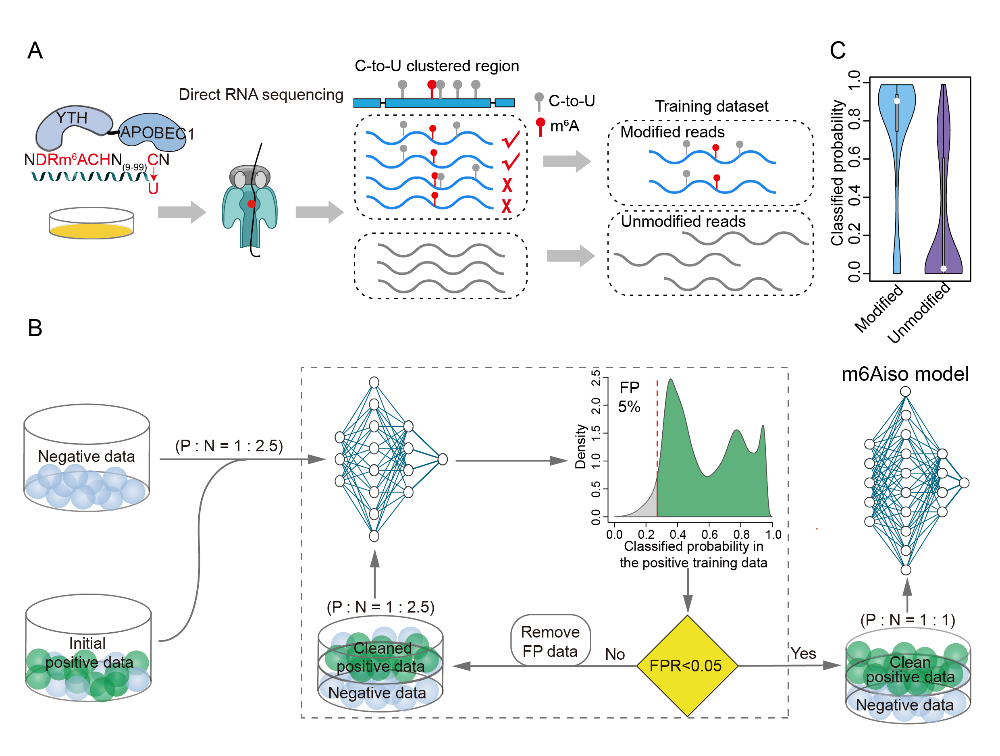

# m6Aiso


m6aiso is a python tool that utilizes endogenously labeled m6A modified signals and a semi-supervised framework to detect m6A modifications from nanopore direct RNA sequencing.

# Table of Contents
- **[Running m6Aiso](#running-m6aiso)**<br>
    - **[Requirements](#requirement)**<br>
    - **[Installation](#installation)**<br>
    - **[Data Prepare](#data-prepare)**<br>
    - **[m6A Prediction](#m6A-prediction)**<br>
    - **[Model Training](#semi-supervised-model-training)**<br>
- **[Getting Help](#getting-help)**<br>
- **[Contribution](#contribution)**<br>
- **[Contacts](#contacts)**<br>
- **[Citing](#citing-m6aiso)**<br>
- **[Contributors](#contributors)**<br>
- **[License](#license)**<br>

# Running m6Aiso

## Requirements

1. pytorch v1.13.0+cu116
2. Nanopolish v0.13.2
3. Python v3.7
4. numpy v1.20.1
5. sklearn v0.24.1
6. pandas v1.2.4

## Installation
m6Aiso requires [Python version 3.7 or higher](https://www.python.org). To install the latest release with PyPI (recommended) run

```sh
$ pip install m6Aiso
```

## Data preparation

m6Aiso data preparation requires eventalign.tsv from ``nanopolish eventalign``:
```
    nanopolish eventalign 
                            --reads <in.fasta> 
                            --bam <in.bam> 
                            --genome <genome.fa> 
                            --signal-index
                            --scale-events 
                            --summary <summary.txt> | gzip > <out.tsv.gzip>
```

After running nanopolish eventalign, we need to preprocess the segmented raw signal file using 'm6Aiso current_signal_abstract_for_m6A_pred':

```
    python -m m6Aiso current_signal_abstract_for_m6A_pred 
                            --nanopolish_result <out.tsv.gzip>
                            --number the number of each batchs
                            --out_dir /path/to/output
```

The output files are stored in ``/path/to/output``:


## m6A prediction

Once `m6Aiso current_signal_abstract_for_m6A_pred` was finished, we can run `m6Aiso molecular_m6A_predication` based on the data preparation output and m6Aiso model:

```
    python -m m6Aiso molecular_m6A_predication 
                            --using_signal_filename signal.tsv 
                            --predict_result_filename molecular_m6A_prob.txt
```

## Semi-supervised model training

If you want to train a new model based on semi-supervised framework, you can run `m6Aiso semi_supervised_model_train` based on the data prepared by youself:
```
    python -m m6Aiso semi_supervised_model_train
                            --model_name AttentionNet,Res1dNet,Res2dNet
                            --orginal_pos_filename modified_signal.tsv
                            --orginal_neg_filename unmodified_signal.tsv
                            --max_value_filename 
                            --min_value_filename
                            --out_dir
```

# Getting help

We appreciate your feedback and questions! You can report any error or suggestion related to m6Aiso as an issue on [github]().

# Contribution

We appreciate contributions on bug fixes and potential new features. Thank you!

# Contacts

Jinkai Wang: wangjk@mail.sysu.edu.cn
WenBing Guo: guowb9@mail2.sysu.edu.cn
ZhiJun Ren: renzhj7@mail.sysu.edu.cn

# Citing m6Aiso

If you use m6Aiso in your research, please cite
[XXXXXXXXXXXXXXXX]()


# Contributors

This package is developed and maintaned by [WangJing Kai] [WenBing Guo] and [ZhiJun Ren](https://github.com/ZJRen9). If you want to contribute, please leave an issue or submit a pull request. Thank you.

# License
m6Anet is licensed under the terms of the MIT license.
